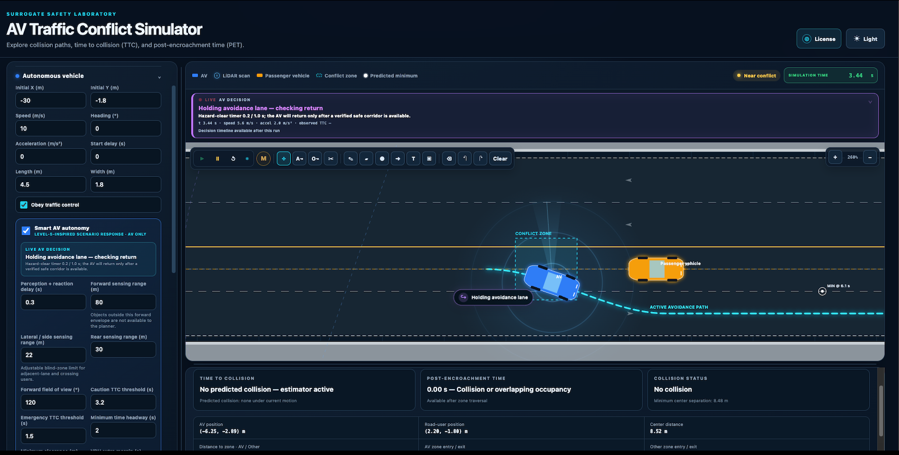
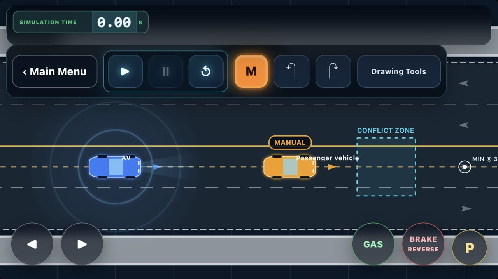

# AV Traffic Conflict Simulator

[](LICENSE)
[](https://github.com/aminKMT/av-traffic-conflict-simulator/actions/workflows/quality.yml)

An interactive browser-based laboratory for exploring **autonomous-vehicle traffic conflicts**, including **Time to Collision (TTC)**, **Post-Encroachment Time (PET)**, predicted collision timing, minimum separation, configurable conflict-zone occupancy, and increasingly interactive AV-behavior experiments.

This repository is the **open-core edition** of the AV Traffic Conflict Simulator. The public core is intended for education, reproducible transportation-safety research, demonstrations, and community contributions. More advanced experimental and product modules can evolve separately from the public core.

> **Status:** v0.1 contains the exported TTC/PET public core. The screenshots below show a newer demonstration build with additional interaction and autonomy capabilities. Not every feature visible in that build is included in the v0.1 public source yet.

## Preview

### Web application



The newer web interface extends the simulator from passive conflict playback toward interactive AV stress testing. The demonstration build includes live AV decision status, active avoidance-path visualization, configurable sensing/response behavior, and richer scenario controls.

### iPhone / iOS home-screen experience



The simulator can also be used from an iPhone as a **home-screen web app experience**. The mobile layout provides touch-oriented simulation controls, including manual road-user controls in supported builds.

> [!IMPORTANT]
> This is a browser-based application added to the iOS Home Screen; it is not being presented here as a native App Store application. Network access may still be required unless offline caching is explicitly configured in a future build.

## What the current public core includes

- Top-down AV-versus-road-user simulation
- Passenger vehicle, pedestrian, and bicycle interaction modes
- Configurable positions, headings, velocities, acceleration, dimensions, and start delays
- Configurable conflict-zone geometry
- Time to Collision (TTC) calculation and collision prediction
- Post-Encroachment Time (PET) based on conflict-zone occupancy
- Collision / near-conflict / safe-passage classification
- Minimum separation tracking
- Play, pause, step, reset, and playback-speed controls
- Example scenarios for direct collision, near conflict, safe passage, and no shared conflict
- Responsive browser UI with no build step or external runtime dependencies

## Newer demonstration-build capabilities

The current development/demo version goes beyond the initial public TTC/PET core. The purpose of these additions is to make the simulator useful for **interactive AV safety experiments**, including deliberately difficult situations created by a human tester.

- **Manual road-user driving:** a tester can take control of a road user with keyboard input in supported desktop builds, creating less predictable and more challenging interactions for the AV.
- **Human-in-the-loop AV stress testing:** manual control makes it possible to create sudden or unusual maneuvers and observe how the AV responds rather than relying only on predefined trajectories.
- **Live AV decisions:** the interface exposes the AV's current behavioral state and decision, such as entering or holding an avoidance maneuver and determining when it is safe to return.
- **Active avoidance-path visualization:** the AV's modified/selected path can be displayed directly on the roadway so that the decision can be inspected spatially while the simulation runs.
- **Interactive path/scenario modification:** newer builds support richer path and scenario editing so experiments can be adjusted instead of being limited to a fixed trajectory.
- **Configurable autonomy behavior:** sensing, reaction, conflict thresholds, and related autonomy parameters can be varied to study how behavior changes under the same traffic interaction.
- **Mobile manual controls:** supported iOS layouts expose touch controls for manual driving and simulation operation.

These capabilities are being separated carefully into public research infrastructure and advanced modules. See [OPEN_CORE.md](OPEN_CORE.md) for the current public/private boundary.

## Live application

> [!CAUTION]
> 🟨 **TBD** build should be linked from GitHub.

`https://YOUR-DOMAIN.example/`
TBD, see [docs/GITHUB_PUBLISHING.md](docs/GITHUB_PUBLISHING.md).

## Use on iPhone or iPad

You do not need an App Store install to place the hosted simulator on the iOS Home Screen:

1. Open the simulator's live URL in **Safari** on the iPhone or iPad.
2. Tap the **Share** button.
3. Choose **Add to Home Screen**.
4. Confirm the displayed name and tap **Add**.
5. Launch the simulator later from its Home Screen icon.

When opened from the Home Screen, the application can feel more app-like and uses the mobile-oriented interface where supported. The exact layout and available controls depend on the deployed simulator version and device size.

## Video Demo

▶️ **[Watch the AV Traffic Conflict Simulator demo on YouTube](https://youtu.be/JRR0XONmysU?si=S6EbAqvx7Cc9FDvm)**

The walkthrough demonstrates TTC/PET analysis, interactive traffic-conflict
simulation, live AV decisions, and avoidance-path
visualization.

## Quick start from source

### Option 1 — open directly

Open `app/index.html` in a modern desktop browser.

### Option 2 — local web server

```bash
python3 -m http.server 8080 -d app
```

Then visit `http://localhost:8080`.

Or:

```bash
npm start
```

## Repository structure

```text
.
├── app/                         # Public browser simulator
│   ├── index.html
│   ├── script.js
│   └── styles.css
├── docs/
│   ├── assets/                  # Actual simulator screenshots used in README
│   └── ...                      # Methodology, architecture, publishing docs
├── tests/                       # Lightweight repository/core checks
├── scripts/                     # Maintainer tooling
├── .github/                     # Issues, PR template, CI
├── CITATION.cff                 # Academic/research citation metadata
├── CONTRIBUTING.md
├── CODE_OF_CONDUCT.md
├── OPEN_CORE.md                 # Public/private feature boundary
├── ROADMAP.md
├── SECURITY.md
└── LICENSE                      # MIT license for this public repository
```

## Safety-measure interpretation

This simulator is a **research and educational tool**, not a certified vehicle-safety system and not a substitute for field validation, standards-compliant simulation, or safety-case evidence.

The current public core treats TTC as a predicted time until road-user footprints overlap under the simulator's motion assumptions. PET is computed from the temporal gap between road users occupying the configured conflict zone. The PET threshold in the UI is explicitly configurable and should not be interpreted as a universal safety standard.

For implementation notes and validation expectations, read [docs/METHODOLOGY.md](docs/METHODOLOGY.md).

## Open-core model

The intention is to make the scientific and educational foundation open while allowing differentiated advanced modules to remain separately licensed. See [OPEN_CORE.md](OPEN_CORE.md) for the boundary.

A practical split is:

**Open:** basic scene configuration, motion simulation, TTC/PET, conflict classification, visualization, examples, documentation, validation tests, and selected extensibility interfaces.

**Separate advanced modules:** richer autonomy policies, advanced decision/planning logic, hosted projects, collaboration, proprietary analytics, specialized scenario packs, customer integrations, and private/restricted data adapters.

The screenshots and demonstrations can show the direction of the full simulator without implying that every demonstrated capability is already distributed in the MIT-licensed v0.1 core.

## Research citation

If you use the simulator in academic work, cite the software using the repository's `CITATION.cff`. GitHub can surface this as a **Cite this repository** action.

Suggested software citation:

> Keramati, A. (2026). *AV Traffic Conflict Simulator* (Version 0.1.0) [Computer software]. GitHub.

Update the citation metadata with a DOI after an archival release if one is created.

## Contributing

Issues and pull requests are welcome for the public core. Start with [CONTRIBUTING.md](CONTRIBUTING.md). Please keep private or separately licensed modules out of public pull requests unless they are intentionally being contributed to the open core.

Good first contribution areas include:

- Unit tests for TTC/PET edge cases
- Additional open scenario examples
- Accessibility and mobile improvements
- Validation notebooks using synthetic scenarios
- Documentation of assumptions
- New surrogate-safety measures with references and tests

## License

The code in this public repository is licensed under the [MIT License](LICENSE).

**Important open-core note:** code not present in this repository is not automatically covered by this license. Separate modules should live in separate repositories or distributions with their own license terms.

## Author

**Amin Keramati**  
Transportation safety · autonomous vehicles · AI/ML · time-to-event risk modeling

GitHub: `@aminKMT`

## Disclaimer

This software is provided for research, education, prototyping, and demonstration. Outputs may be sensitive to assumptions, discretization, geometry, thresholds, and scenario configuration. Do not use simulator output as the sole basis for real-world driving, regulatory, legal, operational, or safety-critical decisions.
